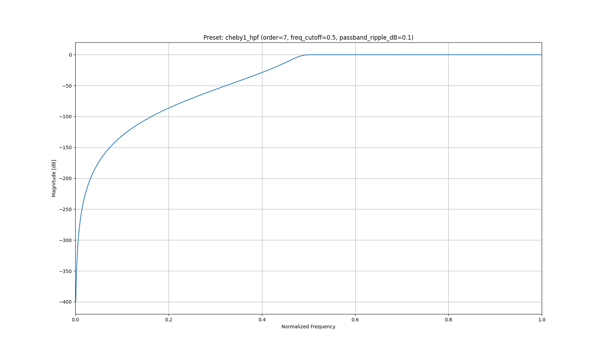
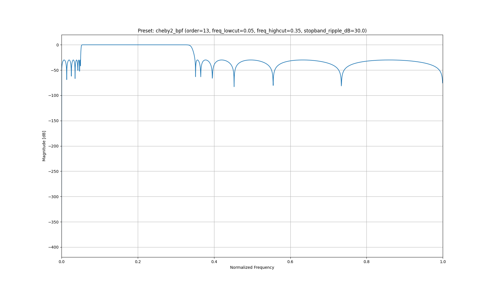
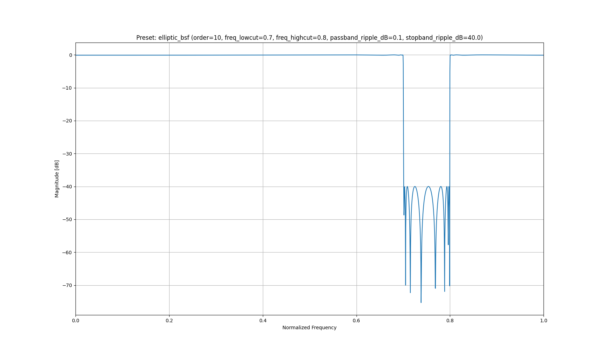
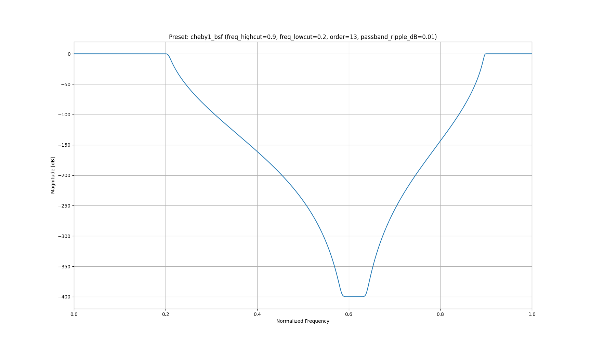

# tiny-iir
Tiny-IIR is a minimal C++ library for generating and applying IIR filters 
with a focus on real-time cutoff frequency updates and embedded-friendly implementation.

Supported filter types:
- Butterworth
- Chebyshev Type I
- Chebyshev Type II
- Elliptic

Supported filter pass types:
- Low-pass
- High-pass
- Band-pass
- Band-stop

Supported data types:
- Floating-point (float, double)
- Fixed-point (Q31, CMSIS-DSP only)

## Including the library with CMSIS-DSP

To use the library with CMSIS-DSP, simply add the following lines to your `CMakeLists.txt` file:

```cmake
set(TINY_IIR_CMSIS_CORE_DIR path/to/CMSIS/Include)
add_subdirectory(path/to/tiny-iir)
target_link_libraries(my-project PRIVATE tiny_iir_core)
```

## Including the library without CMSIS-DSP

To include the library in your project, simply add the following lines to your `CMakeLists.txt` file:

```cmake
set(BUILD_WITH_CMSIS OFF CACHE BOOL "Build using CMSIS-DSP")
add_subdirectory(path/to/tiny-iir)
target_link_libraries(my-project PRIVATE tiny_iir_core)
```

To design a filter simply include a corresponding header file and instantiate the filter object.

```cpp
#include <cheby2/IIRCheby2.h>

/* Create an order 6 Chebyshev Type II filter with a passband of 0.1, 
   a stopband of 60dB and 100 crossfade samples */
tiny_iir::IIRCheby2<6, double, tiny_iir::FilterPassType::LOW_PASS> iir_cheby2{
    0.1, 60.0, 100
};
```

```cpp
#include <elliptic/IIRElliptic.h>

/* Create an order 9 elliptic filter with a passband of [0.4, 0.6], 
   passband ripple of 0.1dB, stopband of 60dB (no crossfade) */
tiny_iir::IIRElliptic<9, float, tiny_iir::FilterPassType::BAND_PASS> iir_elliptic{
    0.4, 0.6, 0.1, 60.0
};
```

To process new samples, simply call the `process` method with the new sample as an argument.

```cpp
/* Process a single sample */
double input = 1.0;
const double output = iir_cheby2.process(input);
```

To process a batch of samples, simply call the `process` method with the new sample as an argument.

```cpp
/* Process a batch of samples */
constexpr size_t NUM_SAMPLES = 4;
const double input[NUM_SAMPLES] = {1.0, 2.0, 3.0, 4.0};
double output = iir_cheby2.process(input, NUM_SAMPLES);
```

## Advanced Usage

The filter class provides a number of methods to configure the filter, reset the filter state, and access the filter coefficients.
```cpp
/* Reconfigure the previously created Chebyshev Type II filter 
   to a different cutoff frequency 0.2 and stopband ripple of 50dB */
iir_cheby2.configure(0.2, 50.0);
```

```cpp
/* Reset the filter state */
iir_cheby2.reset_state();
```

## Plotting tool

A simple Python script is provided to plot the frequency response of the filter.
To use it, simply run the following command:

```sh
python3 tools/plot_sos.py [path/to/coeff_presets.json] [preset_key]
```

A number of presets are provided in the `tools/demo.json` file.
For example, to plot the frequency response of the Chebyshev Type I high-pass filter from the `demo.json` file,
run the following command:

```sh
python3 tools/plot_sos.py tools/demo.json [demo_preset_key]
```

### Example 1: Butterworth Low-Pass Filter
```sh
python3 tools/plot_sos.py tools/demo.json butter_lpf
```


### Example 2: Chebyshev Type I High-Pass Filter
```sh
python3 tools/plot_sos.py tools/demo.json cheby1_hpf
```



### Example 3: Chebyshev Type II Band-Pass Filter

```sh
python3 tools/plot_sos.py tools/demo.json cheby2_bpf
```



### Example 4: Chebyshev Elliptic Band-Stop Filter

```sh
python3 tools/plot_sos.py tools/demo.json elliptic_bsf
```



## Filter Designer CLI Tool

The filter designer CLI tool is a command-line tool that generates filter coefficients 
in JSON format for a given filter type and pass type. These coefficients can then be used 
as input to the plotting tool `plot_sos.py`.

### Usage

Run the tool with the `--help` option to see all the available options:

```sh
Tiny-IIR command-line filter designer

  --type : butter | cheby1 | cheby2 | elliptic
  --pass : lpf | hpf | bpf | bsf

Usage:
  tiny-iir-designer-cli [OPTION...]

  -t, --type arg     filter family
  -p, --pass arg     pass type
  -o, --order arg    order (1-20)
  -l, --lowcut arg   cutoff / lowcut frequency
  -h, --highcut arg  highcut frequency
  -r, --ripple arg   passband ripple dB (default: 0.1)
  -s, --stop arg     stopband atten dB (default: 40)
  -j, --json arg     output file
      --help         help
```

### Example
```sh
tiny-iir-designer-cli -t cheby1 -p bsf -o 13 -l 0.2 -h 0.9 --ripple 0.01 --stop 40 -j out.json
```

This command generates a JSON file `out.json` with the following content:

```json
{
  "cheby1_bsf": {
    "freq_highcut": 0.9,
    "freq_lowcut": 0.2,
    "gain": 1.1791396686005744e-07,
    "order": 13,
    "passband_ripple_dB": 0.01,
    "sos": [
      "1.000000000000000 0.689153033510511 1.000000000000000 1.000000000000000 0.088954857954186 -0.741842947418936",
      "1.000000000000000 0.689153033510511 1.000000000000000 1.000000000000000 1.814786434791573 0.829227992406060",
      "1.000000000000000 0.689153033510511 1.000000000000000 1.000000000000000 -1.626726906315310 0.681910525074229",
      "1.000000000000000 0.689153033510511 1.000000000000000 1.000000000000000 1.817829005206177 0.847956704182647",
      "1.000000000000000 0.689153033510511 1.000000000000000 1.000000000000000 -1.602659726369218 0.717497451822529",
      "1.000000000000000 0.689153033510511 1.000000000000000 1.000000000000000 1.823862411931761 0.875399729695441",
      "1.000000000000000 0.689153033510511 1.000000000000000 1.000000000000000 -1.573104488038493 0.769061959877234",
      "1.000000000000000 0.689153033510511 1.000000000000000 1.000000000000000 1.834489365634947 0.908100920985786",
      "1.000000000000000 0.689153033510511 1.000000000000000 1.000000000000000 -1.549991333140230 0.829750470389297",
      "1.000000000000000 0.689153033510511 1.000000000000000 1.000000000000000 1.851807667992471 0.943637989355412",
      "1.000000000000000 0.689153033510511 1.000000000000000 1.000000000000000 -1.544913921043186 0.895200288910000",
      "1.000000000000000 0.689153033510511 1.000000000000000 1.000000000000000 1.877954929370596 0.980855618909025",
      "1.000000000000000 0.689153033510511 1.000000000000000 1.000000000000000 -1.567701317689928 0.964054701697633"
    ]
  }
}

```

that can be used as input to the plotting tool `plot_sos.py`:

```sh
python3 tools/plot_sos.py out.json cheby2_bsf
```

